# API Tracker

This application was designed to give customers greater insight into their AWS API usage. The lambda function can be associated with a CloudWatch Log Stream of CloudTrail records. The Lambda function processes records on the CloudWatch Logs Stream and publishes custom CloudWatch metrics based on aggregating individual API usage.

This will give you a detailed look into your API usage.

**VERSION:** 0.1.0
**AUTHORS:** Joe Hsieh, Ho Ming Li, Jeremy Wallace

## Design

Here is the data flow:
- Amazon CloudTrail is configured to send API logs to Amazon CloudWatch Logs.
- AWS Lambda is triggered by new records that are written to the CloudWatch Log Stream.
- AWS Lambda aggregates the number of API requests and publishes custom Amazon CloudWatch Metrics.

## Installation

Please follow the instructions below to configure API tracker.

### Part One: Enable CloudTrail and CloudWatch Logs

1. Create an AWS account and sign in to the *AWS Management Console*.
2. Under Management Tools, click on **CloudTrail**.
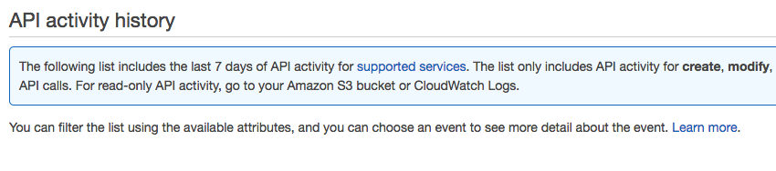
3. Click **Trails** on the left menu bar.
4. Click the blue **Add New Trail** button.
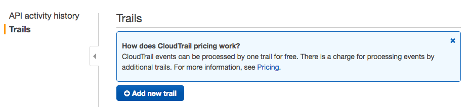
5. Name the trail and pick an *S3* bucket location to store the logs. Press create.
6. Once created, click on your newly created *CloudTrail*.
7. In the section *CloudWatch Logs*, click **configure**.
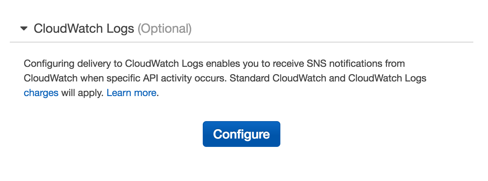
8. If you do not have a *CloudWatch Log Stream* created, name one here and press continue.
9. Review the *IAM* policy and press Allow.
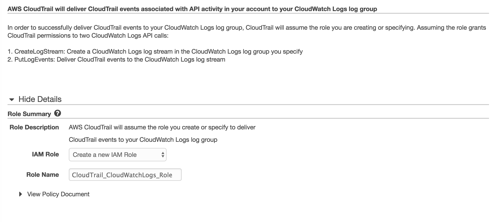
10. Click back to the CloudTrail page and ensure that CloudWatch Logs has been configured.
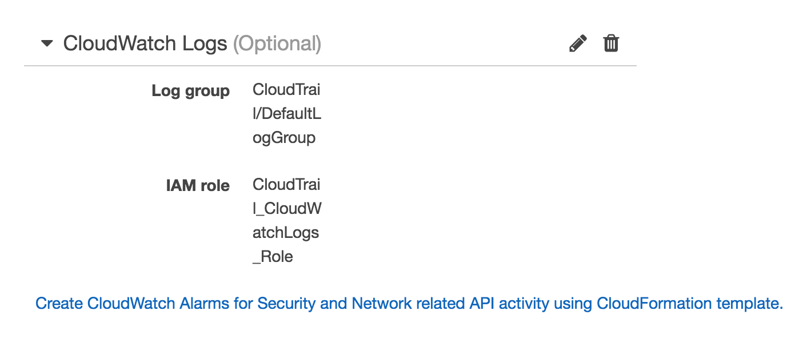

### Part Two: Configure and Upload the Lambda function

1. Locally on your machine, run **npm install** in the **nodejs** directory (cloudwatch-api-tracker).
2. Create a new zip file based on the contents of this directory (cloudwatch-api-tracker).
3. Open the *Lambda* Console page.
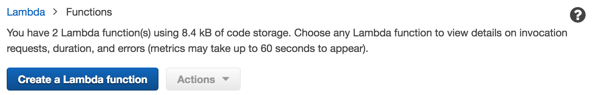
4. Create a new lambda function.
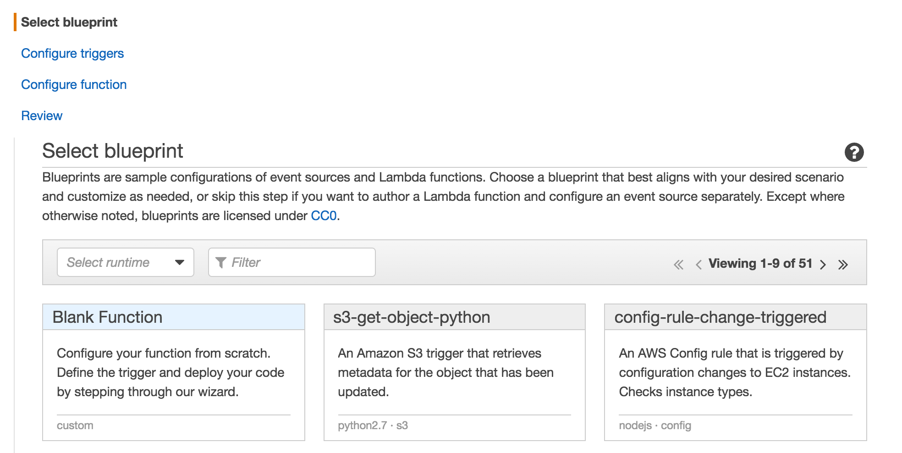
5. Select the **Blank Function** blueprint.
6. Add a CloudWatch Logs Trigger.  
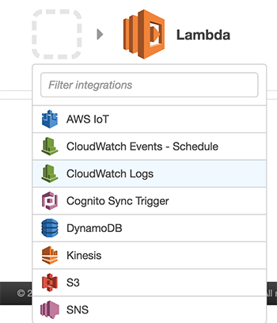
7. Name the filter and use the CloudTrail Log Group that you created above.
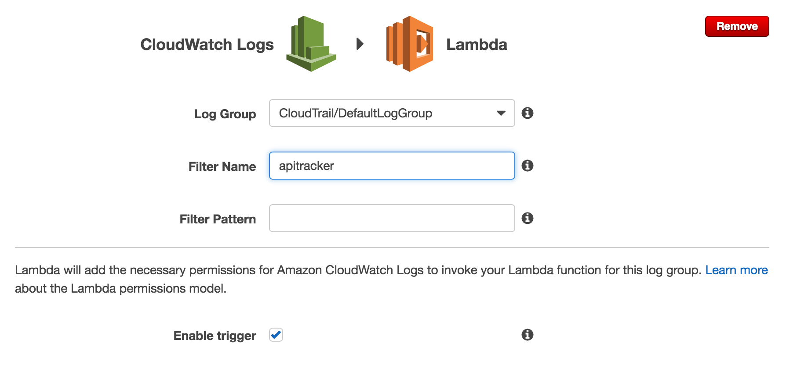
8. Press Next. Name the Lambda function.
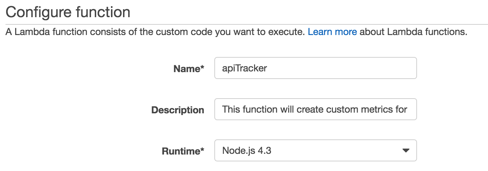
9. Upload the ZIP file that you created above.
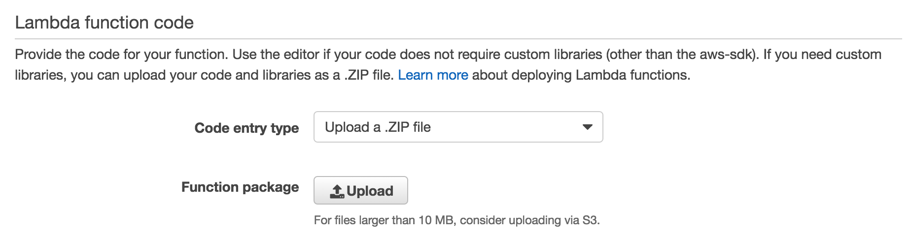
10. Set the handler to app.handler.
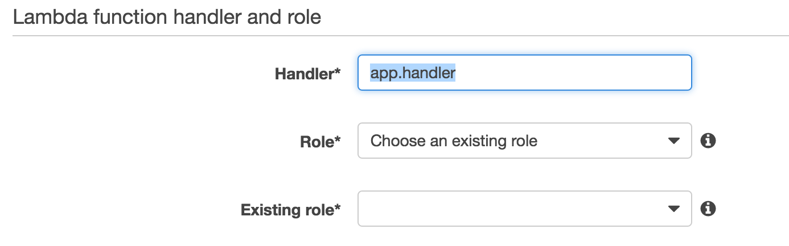
11. Create a new IAM role for the Lambda function with the following IAM policy.
```
{
  "Version": "2012-10-17",
  "Statement": [
  {
    "Effect": "Allow",
    "Action": [
    "logs:CreateLogGroup",
    "logs:CreateLogStream",
    "logs:PutLogEvents"
    ],
    "Resource": "arn:aws:logs:*:*:*"
    },
    {
      "Effect": "Allow",
      "Action": [
      "cloudwatch:PutMetricData"
      ],
      "Resource": [
      "*"
      ]
    }
    ]
  }
```

Congratulations! You have set up API tracker. You will now start to see metrics in CloudWatch.

## Things you can do with the metrics

- Create a CloudWatch Alarm on a particular API.
- Create a CloudWatch Dashboard with the most commonly used APIs.
