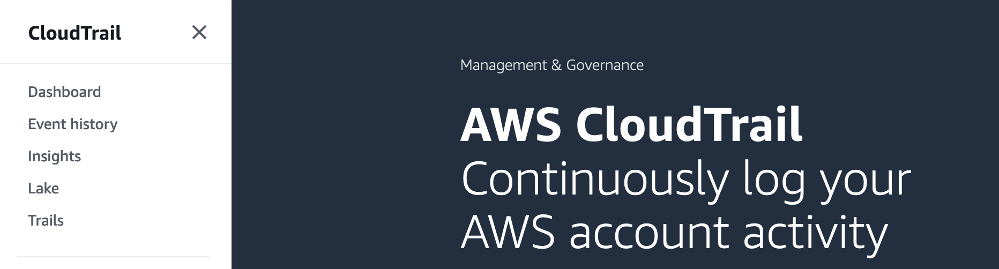
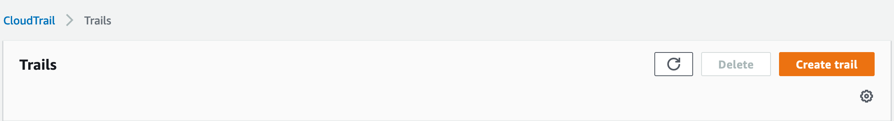
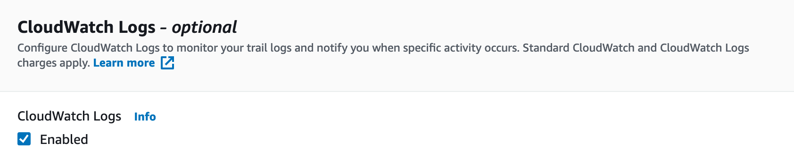
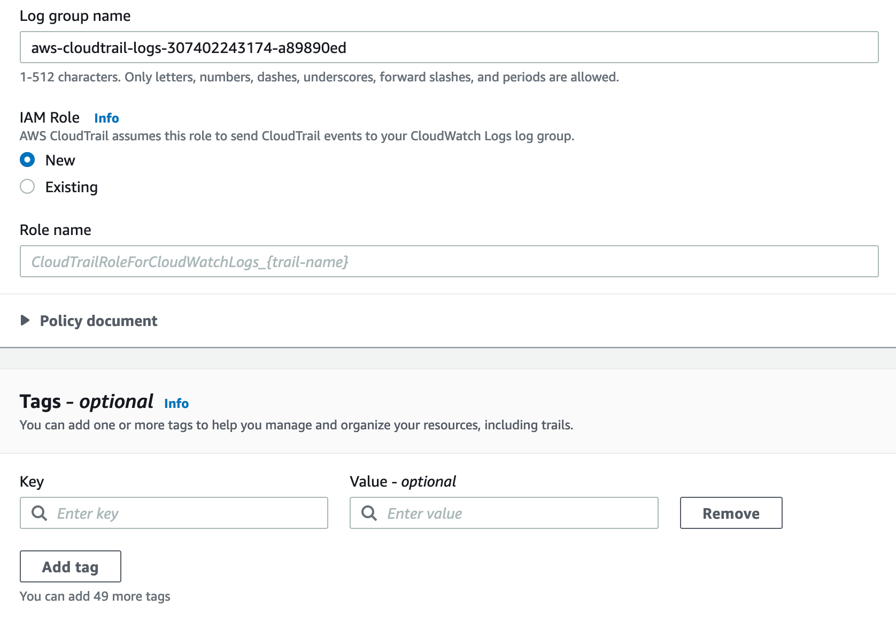
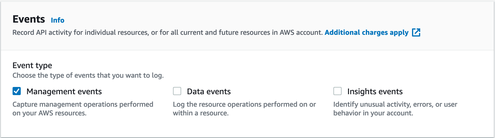
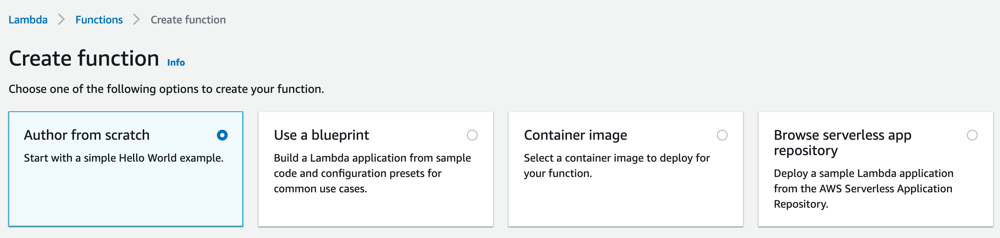
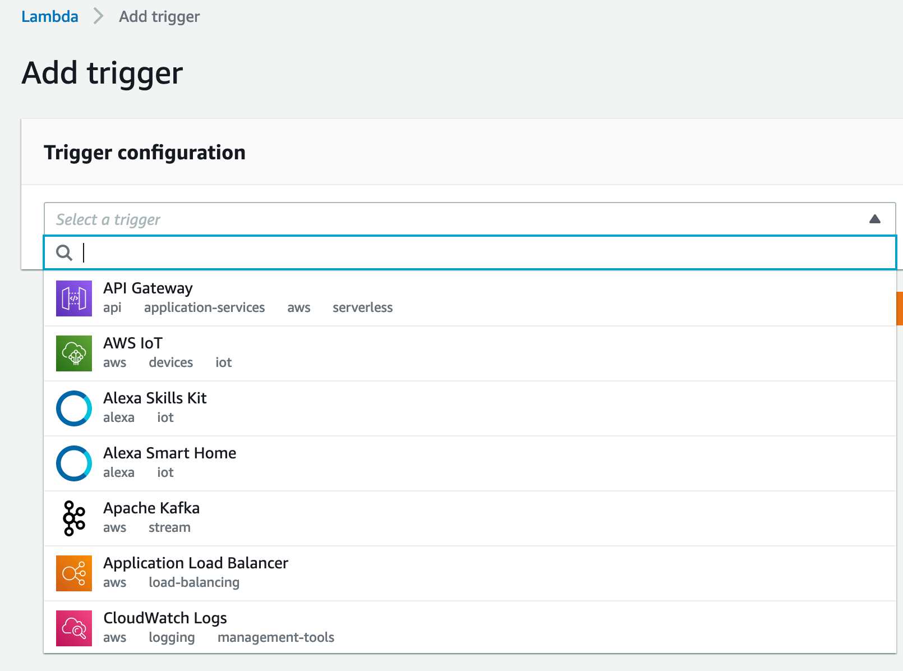
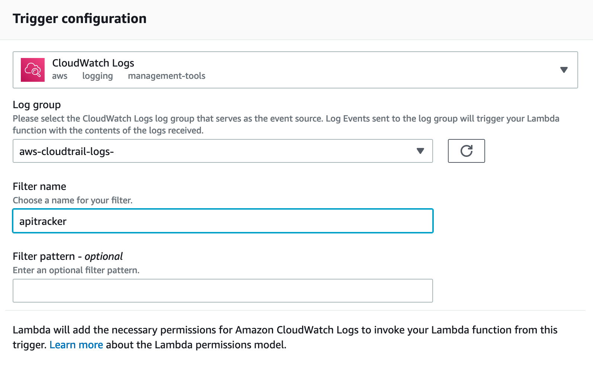
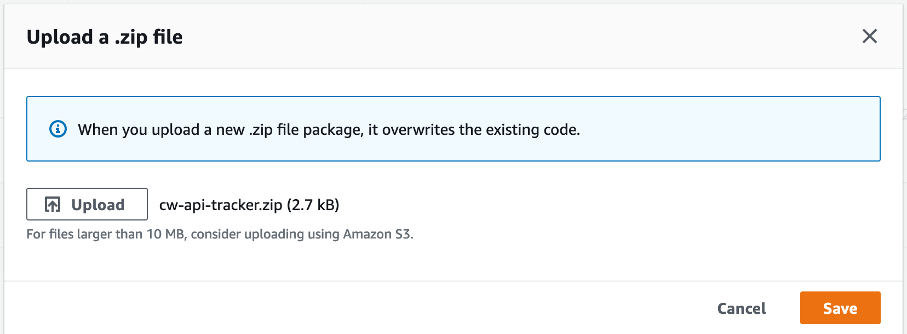
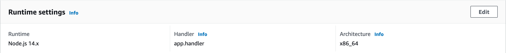

# AWS API Usage Tracker

This application was designed to give customers greater insight into their AWS API usage by generating custom CloudWatch Metrics based on CloudTrail logs.

**VERSION:** 0.1.1

**AUTHORS:** Joe Hsieh, Uzi Ashkenazi, Ho Ming Li, Jeremy Wallace

## Design

Here is the data flow:
- Amazon CloudTrail is configured to send API logs to Amazon CloudWatch Logs.
- AWS Lambda is triggered by new records that are written to the CloudWatch Log Stream.
- AWS Lambda aggregates the number of API requests and publishes custom Amazon CloudWatch Metrics.

By default, if an existing Cloudwatch Log Group is not specified during deployment, a new multi-region trail is created for the purpose of tracking Cloudtrail events. If you would like to use an existing trail, specify it as the `CloudTrailLogGroupName` parameter for CloudFormation.

# Installation

Below are two different ways of configuring your AWS environment to collect metrics on API usage using this lambda function. You could configure the AWS environment with the command line, or through the web console.

## Quick Start - Command Line Installation (Recommended)

1. If you do not have an s3 bucket you can use, create one.

  ```
  $ aws s3 mb s3://<YOUR_S3_BUCKET>
  ```

2. Define the S3 bucket and prefix for SAM artifacts

  ```
  $ export S3_BUCKET=<YOUR_S3_BUCKET>
  $ export S3_PREFIX=cloudwatch-api-tracker-sam-artifacts
  ```

3. Transform the SAM template to get the output template for CloudFormation

  ```
  $ aws cloudformation package --template-file sam.yaml --output-template-file sam-output.yaml --s3-bucket $S3_BUCKET --s3-prefix $S3_PREFIX
  ```

4. Deploy the SAM output template

    a. creates a new trail

    ```
    $ aws cloudformation deploy --template-file sam-output.yaml --stack-name cloudwatch-api-tracker --capabilities CAPABILITY_IAM
    ```

    b. using an existing trail - ensure you have CloudTrail logs sent to CloudWatch Logs. [Follow the guide here](http://docs.aws.amazon.com/awscloudtrail/latest/userguide/send-cloudtrail-events-to-cloudwatch-logs.html). Replace $CloudWatchLogGroupName with your own.
    ```
    $ aws cloudformation deploy --template-file sam-output.yaml --stack-name cloudwatch-api-tracker --capabilities CAPABILITY_IAM --parameter-overrides CloudTrailLogGroupName=$CloudWatchLogGroupName
    ```

5. Soon after CloudFromation stack creation completes, verify that the lambda function is being invoked and that no errors are produced.

Congratulations! You have set up API tracker. You will now start to see metrics in CloudWatch.

## Console Installation

Please follow the instructions below to configure API tracker.

### Part One: Enable CloudTrail and CloudWatch Logs

1. Create an AWS account and sign in to the *AWS Management Console*.
2. Click Services in the top navigation then under Management & Governance, click on **CloudTrail**.



3. Click **Trails** on the left menu bar.
4. Click the orange **Add Trail** button.



5. Name the trail and pick an *S3* bucket location to store the logs.
6. Provide a *Customer managed AWS KMS key* alias or choose an existing one.
7. In the section *CloudWatch Logs*, tick the **Enabled** and provide an *IAM Role* name.



8. A *CloudWatch Log Group* will be created, adjust or accept the default name.
9. Review the *IAM* policy and add any tags (optional).



10. Click next. Select log event type (Management Events is selected by default).



11. Click Next review the settings and click the *Create trail* orange button.

### Part Two: Configure and Upload the Lambda function

1. Locally on your machine, run **npm install** inside the **nodejs** directory (cloudwatch-api-tracker).
2. Create a new zip file based on the contents of this directory (cloudwatch-api-tracker).
3. Open the *Lambda* Console page.


4. Create a new lambda function.



5. Select the **Author from scratch** option provide a function name and select **Node.js** as the runtime.
6. Click create function.
7. Add a CloudWatch Logs Trigger.  


7. Name the filter and use the CloudTrail Log Group created at trail creation.



8. Press Add.
9. Upload the ZIP file that you created above.



10. Set the handler to app.handler.



11. Create a new IAM role for the Lambda function with the following IAM policy.
```
{
  "Version": "2012-10-17",
  "Statement": [
  {
    "Effect": "Allow",
    "Action": [
    "logs:CreateLogGroup",
    "logs:CreateLogStream",
    "logs:PutLogEvents"
    ],
    "Resource": "arn:aws:logs:*:*:*"
    },
    {
      "Effect": "Allow",
      "Action": [
      "cloudwatch:PutMetricData"
      ],
      "Resource": [
      "*"
      ]
    }
    ]
  }
```

Congratulations! You have set up API tracker. You will now start to see metrics in CloudWatch.

## Things you can do with the metrics

- Create a CloudWatch Alarm on a particular API.
- Create a CloudWatch Dashboard with the most commonly used APIs.
